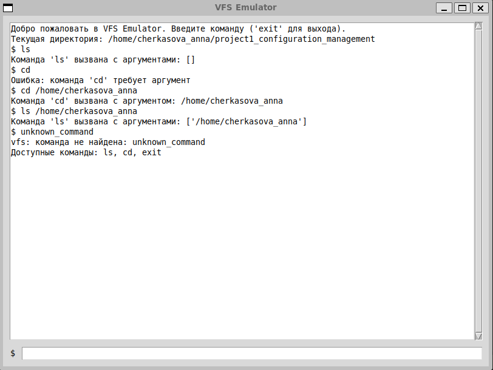

# project1_configuration_management
## Эмулятор командной оболочки ОС с виртуальной файловой системой (VFS)

Общее описание

Данный проект представляет собой эмулятор командной оболочки (shell) для UNIX-подобных операционных систем, работающий в графическом интерфейсе (GUI). ОСновной особенностью эмулятора являются использование виртуальной файловой системы (VFS), загружаемой из XML-файла. Все операции с файлами проводятся в оперативной памяти.

## VFS Emulator - Этап 1: REPL

Функциональность

- Графический интерфейс (GUI)
- Парсинг команд с раскрытием переменных ($HOME)
- Команды: ls, cd, exit
- Обработка ошибок

Скриншоты работы

**Описание:**

- Приветственное сообщение
- Текстовое поле с выводом команд
- Строка ввода с приглашением "$"
- Пример выполнения команды 'ls' без аргументов
- Пример выполнения команды 'cd' без аргумента
- Пример выполнения команды 'cd $HOME'
- Пример выполнения команды 'ls $HOME'
- Пример обработки ошибки
- Список доступных команд
